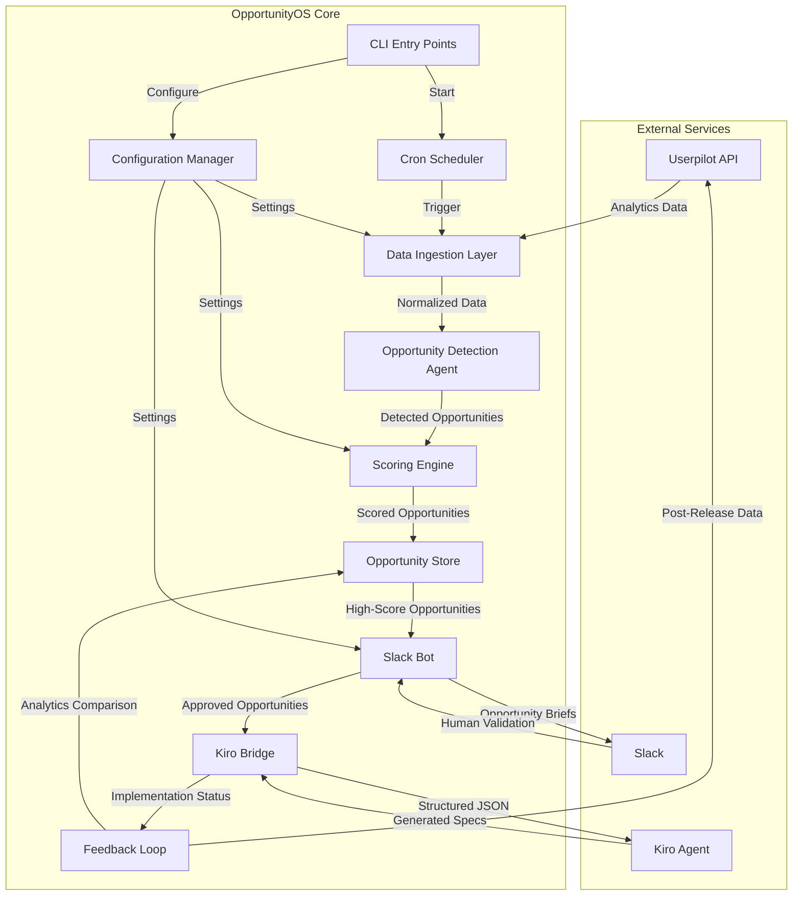

# Design Document: OpportunityOS

## Overview

OpportunityOS is an infrastructure-first, AI-native product intelligence system delivered as an NPM package. The system operates through three primary execution modes: scheduled cron jobs for automated detection, webhook endpoints for event-driven processing, and Slack bot interactions for human validation. The architecture follows a pipeline pattern: data ingestion → opportunity detection → human validation → spec generation → feedback loop.

The system is designed to be stateless where possible, with persistent storage only for opportunity records and configuration. All components communicate through well-defined interfaces, enabling independent testing and future extensibility.

## Architecture

### High-Level Architecture



### Execution Modes

1. **Scheduled Mode**: Cron job triggers data ingestion and detection pipeline
2. **Webhook Mode**: External events trigger immediate processing
3. **Interactive Mode**: Slack commands trigger manual detection runs
4. **Feedback Mode**: Post-release analytics collection and comparison

### Component Responsibilities

- **CLI Entry Points**: Initialize system, start services, run one-off commands
- **Cron Scheduler**: Manage scheduled execution with overlap prevention
- **Data Ingestion Layer**: Fetch, normalize, and validate external data
- **Opportunity Detection Agent**: Analyze data patterns and identify opportunities
- **Scoring Engine**: Calculate opportunity scores with configurable weights
- **Slack Bot**: Post opportunities, handle interactions, manage conversation state
- **Kiro Bridge**: Transform opportunities into Kiro-compatible payloads
- **Feedback Loop**: Compare predictions with actual results, adjust weights
- **Opportunity Store**: Persist and query opportunity records
- **Configuration Manager**: Load, validate, and provide configuration

## Components and Interfaces

### 1. Configuration Manager

**Purpose**: Centralized configuration loading and validation

**Interface**:
```typescript
interface ConfigurationManager {
  load(): Config
  validate(config: Partial<Config>): ValidationResult
  getDefaults(): Config
}

interface Config {
  userpilot: {
    apiKey: string
    baseUrl: string
    timeout: number
  }
  slack: {
    botToken: string
    channelId: string
    retryAttempts: number
  }
  kiro: {
    webhookUrl: string
    timeout: number
  }
  github?: {
    token: string
    repo: string
  }
  scoring: {
    impactWeight: number
    severityWeight: number
    revenueWeight: number
    effortWeight: number
    threshold: number
  }
  cron: {
    schedule: string
    timezone: string
  }
  storage: {
    path: string
  }
  logging: {
    level: 'debug' | 'info' | 'warn' | 'error'
    externalService?: string
  }
  testMode: boolean
}

interface ValidationResult {
  valid: boolean
  errors: string[]
}
```

**Implementation Notes**:
- Load from environment variables with dotenv
- Validate required fields on startup
- Provide sensible defaults for optional fields
- Ensure scoring weights sum to 1.0
- Validate cron expression syntax

### 2. Data Ingestion Layer

**Purpose**: Fetch and normalize data from Userpilot API

**Interface**:
```typescript
interface DataIngestionLayer {
  fetchAnalytics(options: FetchOptions): Promise<AnalyticsData>
  normalize(rawData: UserpilotResponse): AnalyticsData
  retry<T>(operation: () => Promise<T>, maxAttempts: number): Promise<T>
}

interface FetchOptions {
  dateRange: { start: Date; end: Date }
  segments?: string[]
  metrics: MetricType[]
}

type MetricType = 
  | 'feature_usage'
  | 'funnel_dropoffs'
  | 'path_analysis'
  | 'nps_scores'
  | 'segment_engagement'

interface AnalyticsData {
  featureUsage: FeatureUsageMetric[]
  funnelDropoffs: FunnelMetric[]
  pathAnalysis: PathMetric[]
  npsScores: NPSMetric[]
  segmentEngagement: SegmentMetric[]
  timestamp: Date
}

interface FeatureUsageMetric {
  featureId: string
  featureName: string
  usageCount: number
  uniqueUsers: number
  segment: string
}

interface FunnelMetric {
  funnelId: string
  funnelName: string
  step: number
  stepName: string
  enteredCount: number
  completedCount: number
  dropoffRate: number
  segment: string
}

interface PathMetric {
  pathId: string
  sequence: string[]
  userCount: number
  avgTimeToComplete: number
  abandonmentRate: number
  segment: string
}

interface NPSMetric {
  score: number
  responseCount: number
  segment: string
  feedback: string[]
}

interface SegmentMetric {
  segmentId: string
  segmentName: string
  userCount: number
  engagementScore: number
  retentionRate: number
}
```

**Implementation Notes**:
- Use axios for HTTP requests with timeout configuration
- Implement exponential backoff for retries (base delay: 1s, max: 30s)
- Handle rate limiting with 429 status codes
- Validate API responses against expected schema
- Log all API interactions with request/response details

### 3. Opportunity Detection Agent

**Purpose**: Analyze analytics data and identify product opportunities

**Interface**:
```typescript
interface OpportunityDetectionAgent {
  detectOpportunities(data: AnalyticsData): DetectedOpportunity[]
  detectDropoffs(funnels: FunnelMetric[]): DetectedOpportunity[]
  detectFriction(paths: PathMetric[]): DetectedOpportunity[]
  detectUnderutilization(features: FeatureUsageMetric[]): DetectedOpportunity[]
  detectSegmentVariance(segments: SegmentMetric[]): DetectedOpportunity[]
  clusterComplaints(nps: NPSMetric[]): DetectedOpportunity[]
}

interface DetectedOpportunity {
  title: string
  description: string
  segment: string
  affectedUsers: number
  metrics: OpportunityMetrics
  affectedComponents: string[]
  detectionMethod: DetectionMethod
  rawData: any
}

interface OpportunityMetrics {
  dropOffRate?: number
  npsSignal?: number
  avgTimeToComplete?: number
  abandonmentRate?: number
  usageRate?: number
  engagementDelta?: number
}

type DetectionMethod = 
  | 'funnel_dropoff'
  | 'high_friction'
  | 'underutilization'
  | 'segment_variance'
  | 'complaint_cluster'
```

**Detection Algorithms**:

1. **Funnel Dropoff Detection**:
   - Identify steps with dropoff rate > 30%
   - Calculate affected users from entered count
   - Flag multi-step dropoffs as higher severity

2. **High Friction Detection**:
   - Identify paths with avgTimeToComplete > 2x median
   - Identify paths with abandonmentRate > 25%
   - Calculate affected users from path user count

3. **Underutilization Detection**:
   - Identify features with usageRate < 10% of total users
   - Filter for features tagged as "high-value"
   - Calculate potential impact from segment size

4. **Segment Variance Detection**:
   - Compare engagement scores across segments
   - Flag segments with >50% variance from mean
   - Identify features with high variance in usage

5. **Complaint Clustering**:
   - Group NPS feedback by keyword similarity
   - Identify clusters with >10 mentions
   - Extract affected components from feedback text

### 4. Scoring Engine

**Purpose**: Calculate opportunity scores with configurable weights

**Interface**:
```typescript
interface ScoringEngine {
  calculateScore(opportunity: DetectedOpportunity, config: ScoringConfig): ScoredOpportunity
  estimateImpact(opportunity: DetectedOpportunity): number
  estimateSeverity(opportunity: DetectedOpportunity): number
  estimateRevenue(opportunity: DetectedOpportunity): number
  estimateEffort(opportunity: DetectedOpportunity): number
  calculateConfidence(opportunity: DetectedOpportunity): number
}

interface ScoringConfig {
  impactWeight: number
  severityWeight: number
  revenueWeight: number
  effortWeight: number
}

interface ScoredOpportunity extends DetectedOpportunity {
  opportunityScore: number
  confidenceScore: number
  revenueImpactEstimate: number
  effortEstimate: number
  impactScore: number
  severityScore: number
}
```

**Scoring Formula**:
```
opportunityScore = (
  (impactScore * impactWeight) +
  (severityScore * severityWeight) +
  (revenueScore * revenueWeight)
) / (effortScore * effortWeight)

where:
- impactScore = affectedUsers / totalUsers (normalized 0-100)
- severityScore = based on dropoffRate or abandonmentRate (0-100)
- revenueScore = estimated revenue impact (0-100)
- effortScore = estimated development effort in story points (1-100)
- confidenceScore = based on data quality and sample size (0-100)
```

**Implementation Notes**:
- Normalize all component scores to 0-100 range
- Use heuristics for effort estimation based on affected components
- Calculate confidence based on sample size and data recency
- Ensure weights sum to 1.0 during validation

### 5. Opportunity Store

**Purpose**: Persist and query opportunity records

**Interface**:
```typescript
interface OpportunityStore {
  save(opportunity: Opportunity): Promise<void>
  findById(id: string): Promise<Opportunity | null>
  findByStatus(status: OpportunityStatus): Promise<Opportunity[]>
  findByDateRange(start: Date, end: Date): Promise<Opportunity[]>
  updateStatus(id: string, status: OpportunityStatus, metadata?: any): Promise<void>
  query(filter: OpportunityFilter): Promise<Opportunity[]>
}

interface OpportunityFilter {
  status?: OpportunityStatus[]
  segment?: string[]
  minScore?: number
  dateRange?: { start: Date; end: Date }
}

type OpportunityStatus = 
  | 'detected'
  | 'approved'
  | 'dismissed'
  | 'investigating'
  | 'implemented'
```

**Implementation Notes**:
- Use JSON file storage for MVP (one file per opportunity)
- Store in configured storage path with structure: `{storePath}/{id}.json`
- Implement file locking for concurrent access prevention
- Create index file for fast queries
- Validate schema on read/write operations

### 6. Slack Bot

**Purpose**: Post opportunities and handle human validation interactions

**Interface**:
```typescript
interface SlackBot {
  postOpportunity(opportunity: Opportunity): Promise<string>
  handleInteraction(payload: SlackInteractionPayload): Promise<void>
  updateMessage(messageId: string, content: SlackMessage): Promise<void>
  postAlert(message: string): Promise<void>
  start(): Promise<void>
}

interface SlackMessage {
  text: string
  blocks: SlackBlock[]
  attachments?: SlackAttachment[]
}

interface SlackInteractionPayload {
  type: 'block_actions'
  user: { id: string; name: string }
  actions: SlackAction[]
  message: { ts: string }
  response_url: string
}

interface SlackAction {
  action_id: string
  value: string
  type: 'button'
}
```

**Message Format**:
```typescript
function formatOpportunityMessage(opp: Opportunity): SlackMessage {
  return {
    text: `New Opportunity: ${opp.title}`,
    blocks: [
      {
        type: 'header',
        text: { type: 'plain_text', text: opp.title }
      },
      {
        type: 'section',
        fields: [
          { type: 'mrkdwn', text: `*Segment:* ${opp.segment}` },
          { type: 'mrkdwn', text: `*Affected Users:* ${opp.affectedUsers}` },
          { type: 'mrkdwn', text: `*Opportunity Score:* ${opp.opportunityScore.toFixed(1)}` },
          { type: 'mrkdwn', text: `*Confidence:* ${opp.confidenceScore.toFixed(1)}%` },
          { type: 'mrkdwn', text: `*Revenue Impact:* $${opp.revenueImpactEstimate}` },
          { type: 'mrkdwn', text: `*Effort Estimate:* ${opp.effortEstimate} points` }
        ]
      },
      {
        type: 'section',
        text: { type: 'mrkdwn', text: `*Affected Components:*\n${opp.affectedComponents.join(', ')}` }
      },
      {
        type: 'actions',
        elements: [
          { type: 'button', text: { type: 'plain_text', text: '✅ Promote to Spec' }, action_id: 'approve', value: opp.id, style: 'primary' },
          { type: 'button', text: { type: 'plain_text', text: '❌ Dismiss' }, action_id: 'dismiss', value: opp.id, style: 'danger' },
          { type: 'button', text: { type: 'plain_text', text: '🧠 Investigate Further' }, action_id: 'investigate', value: opp.id },
          { type: 'button', text: { type: 'plain_text', text: '📊 Request More Data' }, action_id: 'more_data', value: opp.id }
        ]
      }
    ]
  }
}
```

**Implementation Notes**:
- Use @slack/bolt framework for bot implementation
- Handle socket mode for local development
- Implement retry logic with exponential backoff (max 3 attempts)
- Store message timestamps for updates
- Handle rate limiting (1 message per second)

### 7. Kiro Bridge

**Purpose**: Transform opportunities into Kiro-compatible payloads and trigger spec generation

**Interface**:
```typescript
interface KiroBridge {
  sendToKiro(opportunity: Opportunity): Promise<KiroResponse>
  formatPayload(opportunity: Opportunity): KiroPayload
  handleResponse(response: KiroResponse): Promise<void>
}

interface KiroPayload {
  opportunityId: string
  title: string
  description: string
  context: {
    segment: string
    affectedUsers: number
    metrics: OpportunityMetrics
    affectedComponents: string[]
  }
  requirements: string[]
  constraints: string[]
  successMetrics: string[]
}

interface KiroResponse {
  success: boolean
  specUrl?: string
  prdUrl?: string
  taskListUrl?: string
  error?: string
}
```

**Payload Transformation**:
- Extract requirements from opportunity description and metrics
- Map affected components to technical constraints
- Generate success metrics from opportunity scores
- Include historical context from similar opportunities

**Implementation Notes**:
- Use axios for webhook POST requests
- Set timeout to 60 seconds (spec generation may be slow)
- Retry on network errors but not on 4xx responses
- Log full request/response for debugging

### 8. Feedback Loop

**Purpose**: Compare predictions with actual results and adjust scoring weights

**Interface**:
```typescript
interface FeedbackLoop {
  collectPostReleaseData(opportunity: Opportunity): Promise<PostReleaseData>
  compareResults(opportunity: Opportunity, postData: PostReleaseData): ComparisonResult
  adjustWeights(comparisons: ComparisonResult[]): ScoringConfig
  reportResults(comparison: ComparisonResult): Promise<void>
}

interface PostReleaseData {
  opportunityId: string
  collectionDate: Date
  metrics: {
    actualDropoffChange?: number
    actualNPSChange?: number
    actualUsageChange?: number
    actualRevenueImpact?: number
  }
  affectedUsers: number
}

interface ComparisonResult {
  opportunityId: string
  predicted: OpportunityMetrics
  actual: PostReleaseData['metrics']
  accuracy: {
    dropoffAccuracy?: number
    npsAccuracy?: number
    usageAccuracy?: number
    revenueAccuracy?: number
    overallAccuracy: number
  }
  deviation: number
}
```

**Weight Adjustment Algorithm**:
- Calculate prediction error for each component
- Adjust weights proportionally to error magnitude
- Apply learning rate of 0.1 to prevent overcorrection
- Ensure adjusted weights still sum to 1.0
- Only adjust after collecting 10+ comparisons

**Implementation Notes**:
- Collect post-release data 2 weeks after implementation
- Store comparison results with opportunity record
- Post summary to Slack with accuracy metrics
- Persist updated weights to configuration

### 9. Cron Scheduler

**Purpose**: Manage scheduled execution with overlap prevention

**Interface**:
```typescript
interface CronScheduler {
  start(schedule: string, task: () => Promise<void>): void
  stop(): void
  isRunning(): boolean
}
```

**Implementation Notes**:
- Use node-cron library for scheduling
- Implement mutex lock to prevent concurrent runs
- Log start/end times and execution duration
- Handle task errors without stopping scheduler
- Support graceful shutdown on SIGTERM/SIGINT

### 10. CLI Entry Points

**Purpose**: Provide command-line interface for system operations

**Commands**:
```bash
# Initialize configuration
opportunity-os init

# Run detection once
opportunity-os detect

# Start scheduled detection
opportunity-os start

# Start Slack bot
opportunity-os bot

# Run feedback loop
opportunity-os feedback --opportunity-id <id>

# Query opportunities
opportunity-os list --status approved --min-score 50

# Test mode
opportunity-os detect --test-mode
```

**Implementation Notes**:
- Use commander.js for CLI framework
- Validate arguments before execution
- Provide helpful error messages
- Support --help for all commands
- Exit with appropriate status codes

## Data Models

### Core Types

```typescript
// Main opportunity type
interface Opportunity {
  id: string
  title: string
  description: string
  segment: string
  affectedUsers: number
  dropOffRate?: number
  npsSignal?: number
  revenueImpactEstimate: number
  effortEstimate: number
  opportunityScore: number
  confidenceScore: number
  affectedComponents: string[]
  status: OpportunityStatus
  createdAt: Date
  updatedAt: Date
  approvedAt?: Date
  approvedBy?: string
  dismissedAt?: Date
  dismissedBy?: string
  implementedAt?: Date
  metadata: OpportunityMetadata
}

interface OpportunityMetadata {
  detectionMethod: DetectionMethod
  rawMetrics: OpportunityMetrics
  slackMessageId?: string
  kiroSpecUrl?: string
  postReleaseData?: PostReleaseData
  comparisonResult?: ComparisonResult
}

// Validation schemas
const OpportunitySchema = {
  id: { type: 'string', required: true, pattern: /^opp_[a-z0-9]{16}$/ },
  title: { type: 'string', required: true, minLength: 10, maxLength: 200 },
  segment: { type: 'string', required: true },
  affectedUsers: { type: 'number', required: true, min: 0 },
  opportunityScore: { type: 'number', required: true, min: 0, max: 100 },
  confidenceScore: { type: 'number', required: true, min: 0, max: 100 },
  status: { type: 'enum', required: true, values: ['detected', 'approved', 'dismissed', 'investigating', 'implemented'] },
  createdAt: { type: 'date', required: true }
}
```

### ID Generation

```typescript
function generateOpportunityId(): string {
  const prefix = 'opp_'
  const randomPart = crypto.randomBytes(8).toString('hex')
  return prefix + randomPart
}
```

### Storage Format

Opportunities stored as individual JSON files:
```
{storePath}/
  opp_a1b2c3d4e5f6g7h8.json
  opp_x9y8z7w6v5u4t3s2.json
  index.json
```

Index file structure:
```json
{
  "opportunities": [
    {
      "id": "opp_a1b2c3d4e5f6g7h8",
      "status": "approved",
      "score": 85.3,
      "createdAt": "2024-01-15T10:30:00Z"
    }
  ],
  "lastUpdated": "2024-01-15T10:30:00Z"
}
```


## Correctness Properties

A property is a characteristic or behavior that should hold true across all valid executions of a system—essentially, a formal statement about what the system should do. Properties serve as the bridge between human-readable specifications and machine-verifiable correctness guarantees.

### Property 1: Data Normalization Preserves Required Fields

*For any* raw data fetched from Userpilot_API, normalizing it should produce an AnalyticsData object containing all required metric types (featureUsage, funnelDropoffs, pathAnalysis, npsScores, segmentEngagement) with valid timestamps.

**Validates: Requirements 1.4, 1.5**

### Property 2: API Retry with Exponential Backoff

*For any* API error response, the retry mechanism should implement exponential backoff with increasing delays (1s, 2s, 4s, ...) up to a maximum delay of 30 seconds, and should log each retry attempt with the retry count.

**Validates: Requirements 1.6, 9.3**

### Property 3: Opportunity Detection Completeness

*For any* AnalyticsData containing detectable patterns (abnormal dropoffs >30%, high friction paths >2x median time, underutilized features <10% usage, segment variance >50%, or complaint clusters >10 mentions), the Opportunity_Detection_Agent should identify at least one opportunity for each pattern type present.

**Validates: Requirements 2.1, 2.2, 2.3, 2.4, 2.5**

### Property 4: Scoring Formula Correctness

*For any* detected opportunity with valid metrics, the calculated opportunityScore should equal (impactScore × impactWeight + severityScore × severityWeight + revenueScore × revenueWeight) ÷ (effortScore × effortWeight), where all component scores are normalized to 0-100 range.

**Validates: Requirements 2.6, 2.7**

### Property 5: Detected Opportunity Completeness

*For any* opportunity detected by the Opportunity_Detection_Agent, the resulting object should include all required fields: affectedUsers, opportunityScore, confidenceScore, revenueImpactEstimate, effortEstimate, and affectedComponents array.

**Validates: Requirements 2.8**

### Property 6: Threshold-Based Filtering

*For any* opportunity with opportunityScore exceeding the configured threshold, it should be marked for human review and posted to Slack; opportunities below the threshold should not be posted.

**Validates: Requirements 2.9, 3.1**

### Property 7: Slack Message Completeness

*For any* opportunity posted to Slack, the message should include all required fields (title, segment, affectedUsers, opportunityScore, confidenceScore, revenueImpactEstimate, effortEstimate, affectedComponents) and all four interactive buttons (Promote, Dismiss, Investigate, Request Data).

**Validates: Requirements 3.2, 3.3**

### Property 8: Slack Interaction State Transitions

*For any* opportunity and any button interaction (approve, dismiss, investigate, request_data), the opportunity status should transition correctly: approve → "approved" + Kiro trigger, dismiss → "dismissed", investigate → "investigating", request_data → data fetch trigger.

**Validates: Requirements 3.4, 3.5, 3.6, 3.7**

### Property 9: Slack Retry Logic

*For any* Slack API failure, the system should retry up to 3 times with exponential backoff and log each attempt; after 3 failures, it should log a final error.

**Validates: Requirements 3.8**

### Property 10: Kiro Payload Completeness

*For any* approved opportunity sent to Kiro_Agent, the JSON payload should include all required fields: opportunityId, title, segment, affectedUsers, metrics, and affectedComponents.

**Validates: Requirements 4.1, 4.2**

### Property 11: Kiro Integration Error Handling

*For any* Kiro_Agent integration failure, the system should log the error with full request/response details and post a notification to the Slack channel with the opportunity ID and error message.

**Validates: Requirements 4.8**

### Property 12: Opportunity Persistence with Status

*For any* opportunity at any lifecycle stage (detected, approved, dismissed, implemented), persisting it should store the correct status and corresponding timestamp (createdAt, approvedAt, dismissedAt, or implementedAt).

**Validates: Requirements 5.1, 5.2, 5.3, 5.4**

### Property 13: Opportunity Storage Completeness

*For any* opportunity being stored, the persisted JSON should include all required fields from the Opportunity type schema, and reading it back should produce an equivalent object.

**Validates: Requirements 5.5, 11.1, 11.2**

### Property 14: Query Filter Correctness

*For any* opportunity query with filters (status, segment, dateRange, minScore), all returned opportunities should match ALL specified filter criteria.

**Validates: Requirements 5.6**

### Property 15: Configuration Validation

*For any* configuration missing required environment variables (USERPILOT_API_KEY, SLACK_BOT_TOKEN, KIRO_WEBHOOK_URL, CRON_SCHEDULE, OPPORTUNITY_THRESHOLD), validation should fail with descriptive error messages listing the missing variables.

**Validates: Requirements 6.2, 6.4, 6.5**

### Property 16: Scoring Weight Constraints

*For any* configuration with scoring weights, validation should ensure all weights are positive numbers and should use default values (summing to 1.0) when weights are not provided.

**Validates: Requirements 6.6, 6.7, 6.8**

### Property 17: Feedback Loop Data Collection

*For any* implemented opportunity, the Feedback_Loop should fetch post-release analytics for the same segments and components as the original opportunity, and calculate actual impact metrics (dropoff change, NPS change, usage change).

**Validates: Requirements 7.1, 7.2**

### Property 18: Prediction Accuracy Comparison

*For any* opportunity with post-release data, the comparison should calculate accuracy percentages for each metric type and an overall accuracy score, comparing predicted values against actual values.

**Validates: Requirements 7.3**

### Property 19: Weight Adjustment on Deviation

*For any* set of 10+ comparison results with overall accuracy below 70%, the Feedback_Loop should adjust scoring weights proportionally to error magnitude with a learning rate of 0.1, ensuring adjusted weights still sum to 1.0.

**Validates: Requirements 7.4**

### Property 20: Feedback Loop Persistence and Notification

*For any* completed post-release analysis, the comparison results should be stored with the opportunity record and a summary should be posted to the Slack channel.

**Validates: Requirements 7.5, 7.6**

### Property 21: CLI Command Availability

*For any* CLI command (init, detect, start, bot, feedback, list), executing it with --help should display usage information, and executing it with valid arguments should complete without errors.

**Validates: Requirements 8.3, 8.4, 8.5**

### Property 22: Error Logging Completeness

*For any* error occurring in any component, the log entry should include timestamp, component name, error message, and stack trace; for API errors, it should also include request details and response status.

**Validates: Requirements 9.1, 9.2**

### Property 23: Critical Error Alerting

*For any* error classified as critical (authentication failure, data corruption, system crash), an alert should be posted to the configured Slack channel with error details.

**Validates: Requirements 9.4**

### Property 24: Log Level Filtering

*For any* configured log level (debug, info, warn, error), only log messages at that level or higher severity should be output; debug should show all, error should show only errors.

**Validates: Requirements 9.5**

### Property 25: External Logging Integration

*For any* log message when an external logging service is configured, a structured log object should be sent to the external service with all required fields (timestamp, level, component, message).

**Validates: Requirements 9.6**

### Property 26: Cron Schedule Execution

*For any* valid cron expression, the scheduler should trigger the detection agent at the correct times according to the schedule, logging start time and configuration at each execution.

**Validates: Requirements 10.1, 10.2**

### Property 27: Scheduled Run Completion Logging

*For any* completed scheduled run, the log should include completion time, number of opportunities detected, and number of opportunities posted to Slack.

**Validates: Requirements 10.3**

### Property 28: Scheduler Error Resilience

*For any* scheduled run that fails with an error, the scheduler should log the error and continue executing subsequent scheduled runs without stopping.

**Validates: Requirements 10.4**

### Property 29: Concurrent Execution Prevention

*For any* two scheduled runs that would overlap in time, the scheduler should prevent the second run from starting until the first completes, using a mutex lock.

**Validates: Requirements 10.5**

### Property 30: Cron Expression Parsing

*For any* valid standard cron expression (5 or 6 fields), the scheduler should parse it correctly and schedule executions accordingly; invalid expressions should fail validation with descriptive errors.

**Validates: Requirements 10.6**

### Property 31: Serialization Round Trip

*For any* valid Opportunity object, serializing to JSON then deserializing should produce an equivalent object with all fields preserved.

**Validates: Requirements 11.1, 11.2**

### Property 32: Serialization Validation

*For any* opportunity being serialized, validation should verify all required fields are present before writing; for any JSON being deserialized, validation should verify the structure matches the Opportunity schema.

**Validates: Requirements 11.3, 11.4**

### Property 33: Deserialization Error Handling

*For any* invalid JSON that fails schema validation during deserialization, the system should log the error with the invalid data and skip the record without crashing.

**Validates: Requirements 11.5**

### Property 34: Test Mode Mock Data Generation

*For any* test mode execution, the system should generate realistic mock opportunities with varied scores (20-95 range), different segments (at least 3), and different detection methods, without making real API calls to Userpilot, Slack, or Kiro.

**Validates: Requirements 12.1, 12.2, 12.3, 12.4**

### Property 35: Test Mode Action Logging

*For any* action taken in test mode (data fetch, opportunity post, Kiro call), the system should log the action with "TEST MODE" prefix and all parameters that would be used in production.

**Validates: Requirements 12.5**

## Error Handling

### Error Categories

1. **External Service Errors**
   - Userpilot API failures (network, timeout, 4xx, 5xx)
   - Slack API failures (rate limiting, network, invalid token)
   - Kiro webhook failures (timeout, network, 4xx, 5xx)

2. **Data Validation Errors**
   - Invalid configuration (missing required vars, invalid weights)
   - Invalid opportunity data (missing fields, invalid types)
   - Invalid JSON during serialization/deserialization

3. **System Errors**
   - File system errors (permission denied, disk full)
   - Concurrent access conflicts
   - Cron scheduling errors

### Error Handling Strategies

**Retry with Exponential Backoff**:
- Applied to: All external API calls
- Configuration: Base delay 1s, max delay 30s, max attempts 3
- Implementation:
  ```typescript
  async function retryWithBackoff<T>(
    operation: () => Promise<T>,
    maxAttempts: number = 3
  ): Promise<T> {
    let lastError: Error
    for (let attempt = 1; attempt <= maxAttempts; attempt++) {
      try {
        return await operation()
      } catch (error) {
        lastError = error
        if (attempt < maxAttempts) {
          const delay = Math.min(1000 * Math.pow(2, attempt - 1), 30000)
          logger.warn(`Attempt ${attempt} failed, retrying in ${delay}ms`, { error })
          await sleep(delay)
        }
      }
    }
    throw lastError
  }
  ```

**Graceful Degradation**:
- If Slack posting fails after retries: Log opportunity locally, continue processing
- If Kiro integration fails: Notify user in Slack, store opportunity for manual processing
- If feedback loop fails: Log error, don't block main detection pipeline

**Validation and Early Exit**:
- Validate configuration on startup, exit with code 1 if invalid
- Validate opportunity data before processing, skip invalid records
- Validate JSON schema before deserialization, skip invalid files

**Circuit Breaker Pattern** (Future Enhancement):
- Track failure rates for external services
- Temporarily disable service calls if failure rate > 50%
- Automatically re-enable after cooldown period

### Error Logging Format

```typescript
interface ErrorLog {
  timestamp: string
  level: 'error' | 'warn'
  component: string
  message: string
  error: {
    name: string
    message: string
    stack: string
  }
  context?: {
    opportunityId?: string
    apiEndpoint?: string
    requestData?: any
    responseStatus?: number
  }
}
```

### Critical Error Alerts

Post to Slack for:
- Authentication failures (Userpilot, Slack, Kiro)
- Data corruption detected
- Scheduler stopped unexpectedly
- Storage system failures

Alert format:
```
🚨 CRITICAL ERROR in OpportunityOS

Component: {component}
Error: {error message}
Time: {timestamp}
Context: {relevant context}

Action Required: {suggested action}
```

## Testing Strategy

### Dual Testing Approach

OpportunityOS requires both unit tests and property-based tests for comprehensive coverage:

- **Unit tests**: Verify specific examples, edge cases, and error conditions
- **Property tests**: Verify universal properties across all inputs

Both testing approaches are complementary and necessary. Unit tests catch concrete bugs in specific scenarios, while property tests verify general correctness across a wide range of inputs.

### Property-Based Testing Configuration

**Library Selection**: Use `fast-check` for TypeScript/JavaScript property-based testing

**Test Configuration**:
- Minimum 100 iterations per property test (due to randomization)
- Each property test must reference its design document property
- Tag format: `// Feature: opportunity-os, Property {number}: {property_text}`

**Example Property Test Structure**:
```typescript
import fc from 'fast-check'

describe('OpportunityOS Property Tests', () => {
  it('Property 13: Opportunity Storage Completeness', () => {
    // Feature: opportunity-os, Property 13: Opportunity storage round trip
    fc.assert(
      fc.property(
        opportunityArbitrary(),
        async (opportunity) => {
          const store = new OpportunityStore(testConfig)
          await store.save(opportunity)
          const retrieved = await store.findById(opportunity.id)
          
          expect(retrieved).toEqual(opportunity)
        }
      ),
      { numRuns: 100 }
    )
  })
})
```

### Unit Testing Focus Areas

**Specific Examples**:
- Startup with valid configuration
- Cron trigger initiates data fetch
- Webhook trigger initiates data fetch
- Manual Slack command initiates data fetch
- Authentication failure returns descriptive error
- GitHub token is read when configured
- Default scoring weights sum to 1.0
- Test mode uses mocks instead of real APIs
- README.md exists with required sections
- TypeScript definitions are included
- Node.js version is specified in package.json
- System startup logs configuration (excluding credentials)

**Edge Cases**:
- Empty analytics data
- Opportunity with all optional fields missing
- Concurrent scheduled runs
- Invalid cron expressions
- Malformed JSON in storage files
- API responses with unexpected structure

**Error Conditions**:
- Missing required environment variables
- Invalid scoring weights (negative, non-numeric)
- Slack API rate limiting
- Userpilot API timeout
- Kiro webhook unreachable
- File system permission errors
- Deserialization of corrupted JSON

**Integration Points**:
- Data flow from ingestion through detection to Slack
- Approval flow from Slack through Kiro bridge
- Feedback loop from implementation through analytics to weight adjustment

### Test Data Generators

**Arbitrary Generators for Property Tests**:
```typescript
// Generate valid opportunities
function opportunityArbitrary(): fc.Arbitrary<Opportunity> {
  return fc.record({
    id: fc.string().map(s => `opp_${s.slice(0, 16)}`),
    title: fc.string({ minLength: 10, maxLength: 200 }),
    description: fc.string({ minLength: 20, maxLength: 1000 }),
    segment: fc.constantFrom('enterprise', 'smb', 'free', 'trial'),
    affectedUsers: fc.integer({ min: 1, max: 100000 }),
    dropOffRate: fc.option(fc.float({ min: 0, max: 1 })),
    npsSignal: fc.option(fc.float({ min: -100, max: 100 })),
    revenueImpactEstimate: fc.integer({ min: 0, max: 1000000 }),
    effortEstimate: fc.integer({ min: 1, max: 100 }),
    opportunityScore: fc.float({ min: 0, max: 100 }),
    confidenceScore: fc.float({ min: 0, max: 100 }),
    affectedComponents: fc.array(fc.string(), { minLength: 1, maxLength: 5 }),
    status: fc.constantFrom('detected', 'approved', 'dismissed', 'investigating', 'implemented'),
    createdAt: fc.date(),
    updatedAt: fc.date(),
    metadata: fc.record({
      detectionMethod: fc.constantFrom('funnel_dropoff', 'high_friction', 'underutilization', 'segment_variance', 'complaint_cluster'),
      rawMetrics: fc.record({})
    })
  })
}

// Generate valid analytics data
function analyticsDataArbitrary(): fc.Arbitrary<AnalyticsData> {
  return fc.record({
    featureUsage: fc.array(featureUsageArbitrary(), { minLength: 1, maxLength: 20 }),
    funnelDropoffs: fc.array(funnelMetricArbitrary(), { minLength: 1, maxLength: 10 }),
    pathAnalysis: fc.array(pathMetricArbitrary(), { minLength: 1, maxLength: 15 }),
    npsScores: fc.array(npsMetricArbitrary(), { minLength: 1, maxLength: 5 }),
    segmentEngagement: fc.array(segmentMetricArbitrary(), { minLength: 1, maxLength: 8 }),
    timestamp: fc.date()
  })
}

// Generate configurations with various validity states
function configArbitrary(): fc.Arbitrary<Partial<Config>> {
  return fc.record({
    userpilot: fc.option(fc.record({
      apiKey: fc.string(),
      baseUrl: fc.webUrl(),
      timeout: fc.integer({ min: 1000, max: 60000 })
    })),
    slack: fc.option(fc.record({
      botToken: fc.string(),
      channelId: fc.string(),
      retryAttempts: fc.integer({ min: 1, max: 5 })
    })),
    scoring: fc.option(fc.record({
      impactWeight: fc.float({ min: 0, max: 1 }),
      severityWeight: fc.float({ min: 0, max: 1 }),
      revenueWeight: fc.float({ min: 0, max: 1 }),
      effortWeight: fc.float({ min: 0, max: 1 }),
      threshold: fc.float({ min: 0, max: 100 })
    }))
  })
}
```

### Mock Services for Testing

**Test Mode Implementation**:
```typescript
class MockUserpilotAPI implements DataIngestionLayer {
  async fetchAnalytics(options: FetchOptions): Promise<AnalyticsData> {
    logger.info('[TEST MODE] Fetching analytics', { options })
    return generateMockAnalyticsData()
  }
}

class MockSlackBot implements SlackBot {
  private messages: Map<string, SlackMessage> = new Map()
  
  async postOpportunity(opportunity: Opportunity): Promise<string> {
    const messageId = `mock_msg_${Date.now()}`
    logger.info('[TEST MODE] Posting to Slack', { opportunity })
    this.messages.set(messageId, formatOpportunityMessage(opportunity))
    return messageId
  }
  
  async handleInteraction(payload: SlackInteractionPayload): Promise<void> {
    logger.info('[TEST MODE] Handling interaction', { payload })
  }
}

class MockKiroBridge implements KiroBridge {
  async sendToKiro(opportunity: Opportunity): Promise<KiroResponse> {
    logger.info('[TEST MODE] Sending to Kiro', { opportunity })
    return {
      success: true,
      specUrl: 'https://mock.kiro.ai/spec/123',
      prdUrl: 'https://mock.kiro.ai/prd/123',
      taskListUrl: 'https://mock.kiro.ai/tasks/123'
    }
  }
}
```

### Test Coverage Goals

- **Line Coverage**: >80% for all components
- **Branch Coverage**: >75% for conditional logic
- **Property Coverage**: 100% of design properties implemented as tests
- **Integration Coverage**: All component interactions tested

### Continuous Testing

- Run unit tests on every commit
- Run property tests on every PR
- Run integration tests nightly
- Monitor test execution time (target: <2 minutes for unit tests, <5 minutes for property tests)
